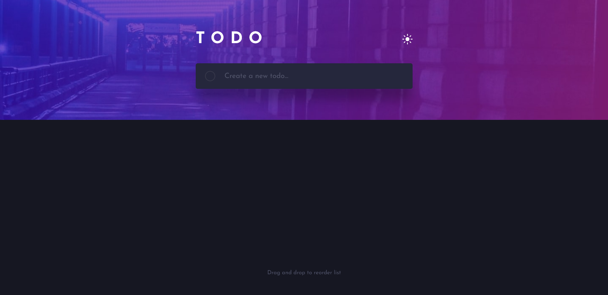
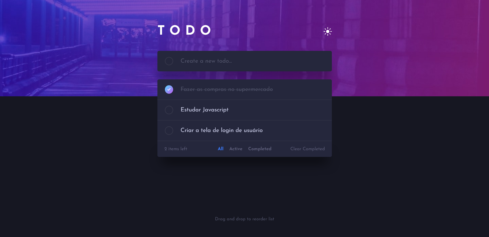
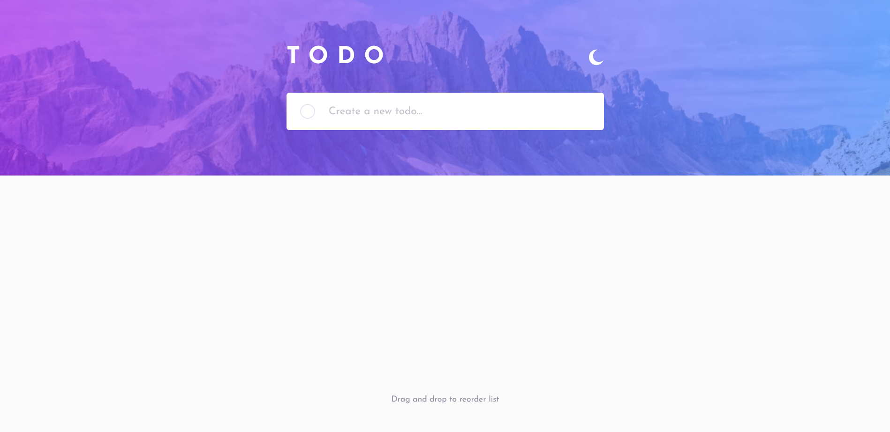
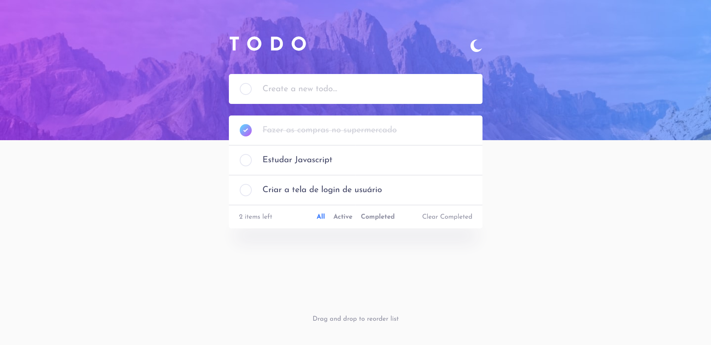
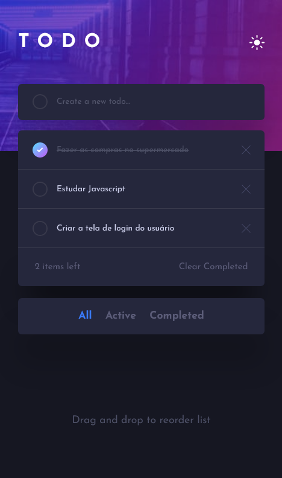
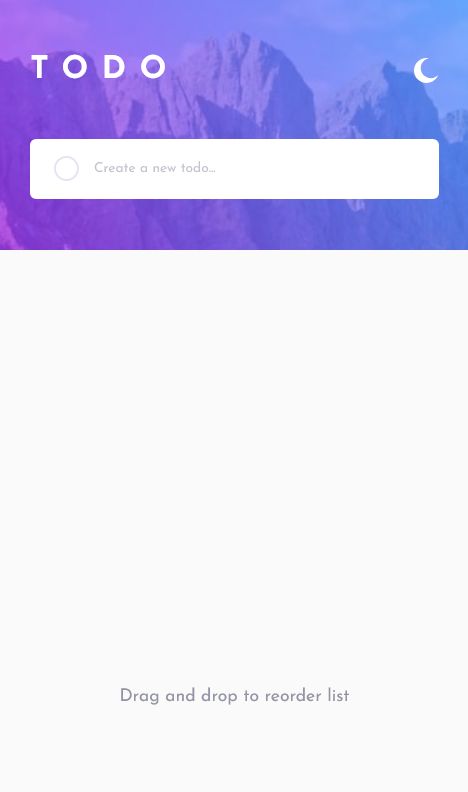
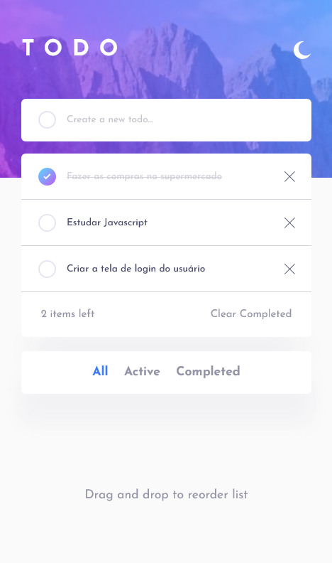

<h1 align="center">
    Aplicato de lista de tarefas
</h1>

Projeto criado em um dos desafios do Frontend Mentor. Um aplicativo de lista de tarefas, que funciona tanto no desktop quanto no mobile, onde o usuário tem também a opção de escolher o tema dark ou light.

# Tabela de conteúdos

* [Demonstração do site](#gear-Demonstração-do-site)
* [Tecnologias](#computer-Tecnologias)
* [Licensa](#page_facing_up-Licensa)

# :gear: Demonstração do site

## Layout Desktop

    
    
    
    

## Layout Mobile

    
    
    
    

# :computer: Tecnologias

Este projeto foi desenvolvido utilizando as seguintes tecnologias:

* HTML5
* CSS3
* Javascript

# :page_facing_up: Licensa

Este layout é o layout de um dos desafios do [Frontend Mentor](https://www.frontendmentor.io/).

Codado por [João Vitor](https://github.com/JVUser01) :rocket:. Esse projeto está sob a [licença MIT](LICENSE.txt).